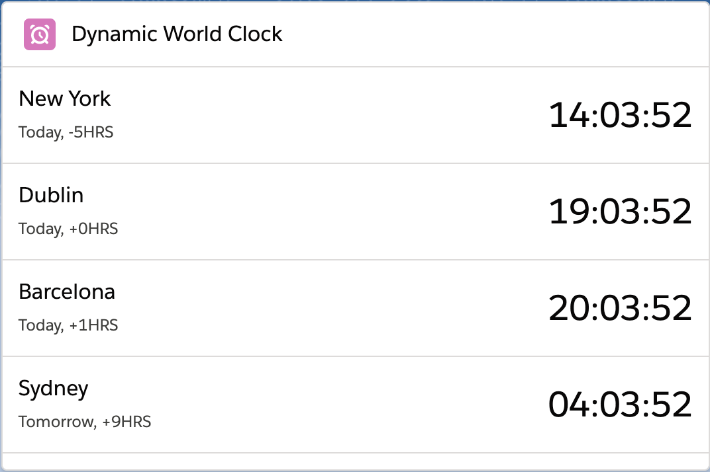
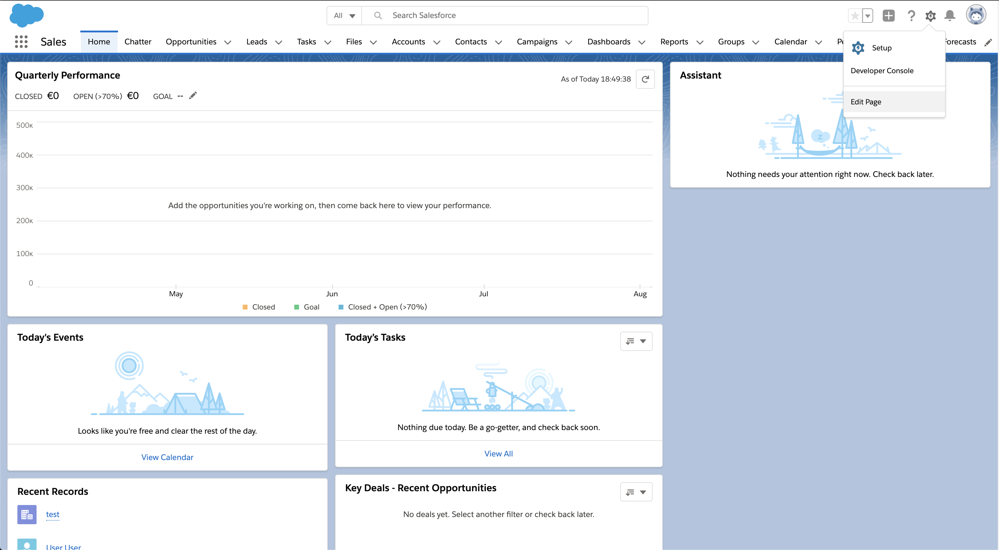
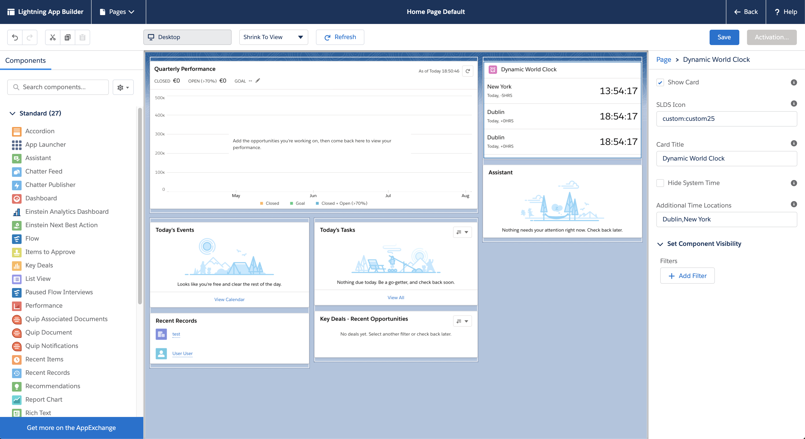
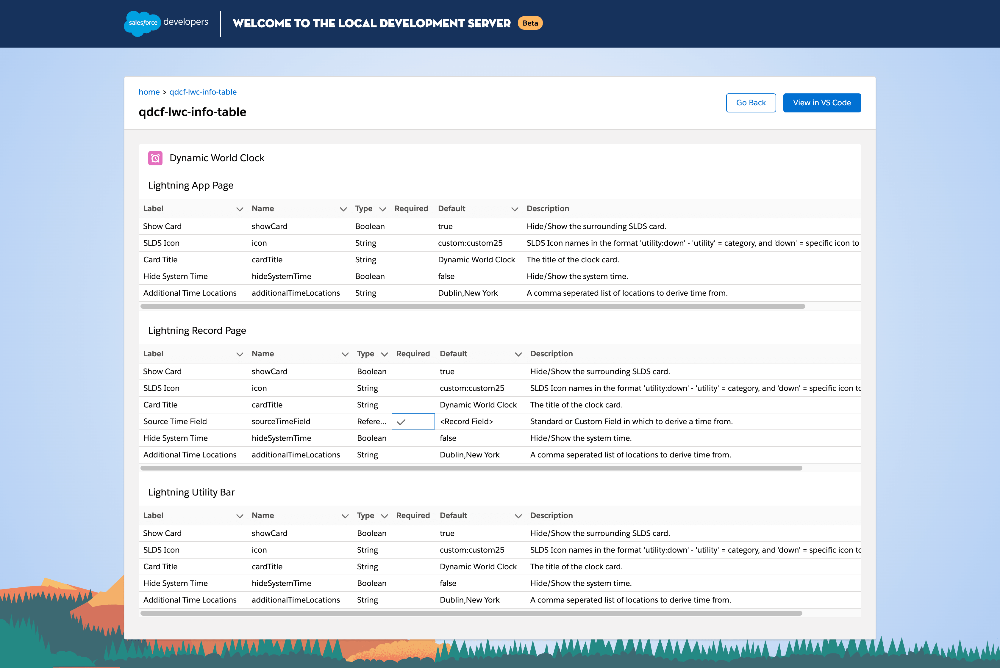
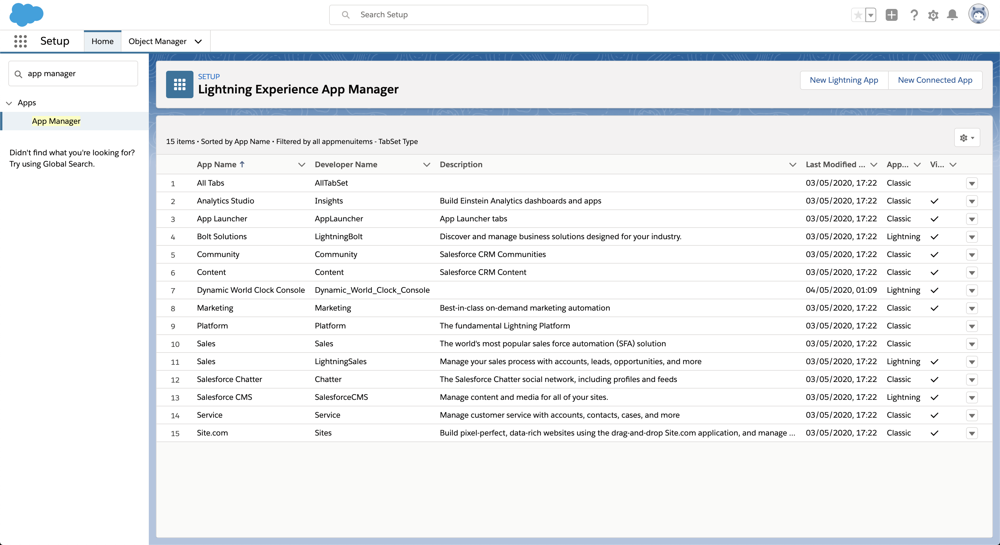
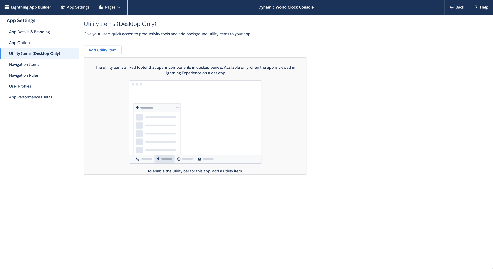
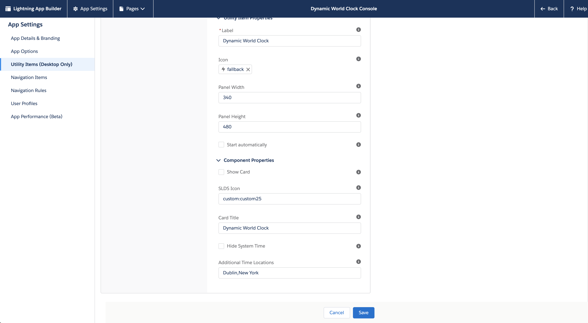
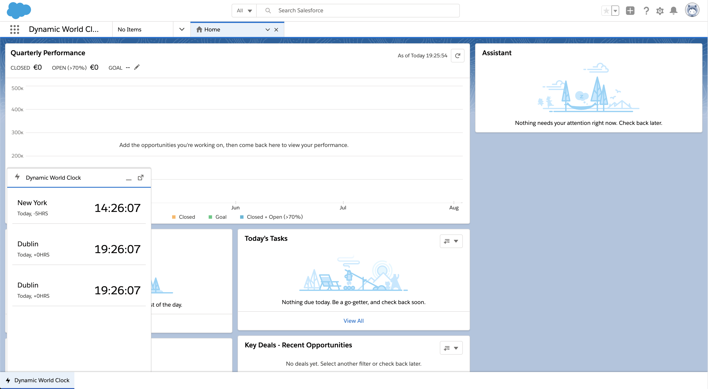

<!--
Badges unsupported
[![Stars][stars-shield]][repository-url] [![Forks][forks-shield]][repository-url] [![Downloads][downloads-shield]][downloads-url] [![Issues][issues-shield]][issues-url]
-->

	

# <a href="https://appexchange.salesforce.com/appxListingDetail?listingId=a0N3A00000FZGsLUAX">Dynamic World Clock</a>

#### Configurable record driven World Clock

#### This clock component can be shown on any record or app page, or even place it in the utility bar. It can detect location from standard and custom fields or use the system time along with a list of additional locations if desired.

<h4 align="center">
	<a href="#features">Features</a> |
	<a href="#getting-started">Getting Started</a> |
	<a href="#usage">Usage</a> |
	<a href="#faqs">FAQs</a> |
	<a href="#documentation">Documentation</a> |
    <!--
    <a href="#tests">Tests</a> |
    -->
	<a href="#contributing">Contributing</a> |
	<a href="#acknowledgements">Acknowledgements</a> 🥰
</h4>

	

---

## Features

Use this highly customisable component to give you a dynamic display of world time from any location in your organisation.

This clock component can be shown on any record or app page, or even place it in the utility bar. It can detect location from standard and custom fields or use the system time along with a list of additional locations if desired.

The component also allows for additional cities to be added through the design attributes to give the user ultimate flexibility.

- **Available on App/Record/Utility -** This component can be used on App Pages, Record Pages and even in the Utility Bar.
- **Field flexibility -** Use any standard or custom field on the record to get the local time, for example Billing City or Shipping City.
- **Additional times -** Add additional locations in the design attributes of the component.

## Getting Started

### Prerequisites

There are a few items you need to setup before installing:

1. You will need to [Enable Lightning Experience](https://trailhead.salesforce.com/en/content/learn/modules/lex_migration_introduction/lex_migration_introduction_administration).
2. You will need to [Enable My Domain](https://trailhead.salesforce.com/en/content/learn/modules/identity_login/identity_login_my_domain).

### Install

Please navigate to the AppExchange link below to install the component.

	

## Usage

There is only 1 Lightning Web Component available in the App Builder with this package:

- Dynamic World Clock

### Dynamic World Clock

#### Notice

If you are getting the message “No times to display” after installing the component, please navigate to Setup and then CSP Trusted Sites. There should be an entry called “Google API”. Hit edit and uncheck the “Active” checkbox and hit save. Then hit edit again and check the “Active” checkbox again and hit save. There seems to be a strange issue where Salesforce doesn’t recognise a CSP trusted site from a package immediately.

#### Adding components to a App or Record Page:

Navigate to your app or record page that you want to add the component to and click the cog icon on the top right and select “Edit Page” see screenshot below.

	

This will bring you to the App Builder for the specific page you clicked “Edit Page” from. Scroll down to the Custom - Managed section on the left hand side component list. From there you can drag the “Dynamic World Clock” component onto any section of the page as shown in the next screenshot below.

	

As you can see after dropping the component onto the page, there are a number of configurable attributes to the component. Here is an explanation of all the input values depending on which type of page you are using it on.

	

Note that the only additional attribute between an App Page and a Record Page is the “Source Time Field”. When placed on a record page, this attribute gives you a dropdown list of all available fields on the object you have placed the component on. Available fields include String, Picklist and Address fields, however it should be noted that the user will need to have access to the selected field in order for the component to read it.

#### Adding components to a Utility Bar:

To add the component to the Utility bar of a console app, you will need to know the name of the console app. Once you have that, you can click the cog on the top right of any page and click “Setup”. From there, type “App Manager” in the quick find box and you should be placed on a page like the screenshot below.

	

From this page, you will need to find the console app we noted from earlier and click the dropdown action button on the right hand side of its name and press “Edit”. This will open up the App Builder for the console app. From here we need to click “Utility Items (Desktop Only)” on the left hand vertical navigation. The resulting page should look like the screenshot below.

	

From here, you can click on the “Add Utility Item” button. This will give you a list of all available components, but the component we are looking for is the “Dynamic World Clock” component that should be in the “Custom - Managed” section near the bottom. Once you click that, you will be presented with a list of configurable options that are split into two sections, “Utility Item Properties” & “Component Properties”. The “Component Properties” are explained in the Design Attributes screenshot above. There are default attributes in place but please feel free to customise these to suit your needs, in particular the “Hide System Time” & “Additional Time Locations” fields as they control the locations that are shown in the component. Once you’re happy with your selections. Please press the save button at the bottom of the page. Screenshot below.

	

Once you have saved this page, you can press the “Back” button on the top right of the page which will bring you back to setup. From here use the app launcher to navigate back to your console app to see the component in action.

See the screenshot below for utility bar view of the component and note the “Start Automatically” attribute in the previous screenshot which makes the component auto pop when the page loads.

	

### Supported config options

	
</>

## Documentation

Read the [Quip][quip-url] for external documentation on the component.

<!---
## [Tests][tests-url]

ADD JEST TESTS
-->

## FAQs

#### Does it work in Communities?

> Yes

#### Does it work in Mobile?

> No, but this is on the roadmap

#### Does it work with Person Accounts?

> Yes

#### Does it support Internationalisation (i18n)?

> No, but this is on the roadmap

#### Others?

## [Contributing](/CONTRIBUTING.md)

See the list of [Contributors][contributors-url] who participated in this project.

If you would like to join these awesome people, please refer to [contributing.md](/CONTRIBUTING.md) for guidelines.

## Acknowledgements

Special thanks to:

- Q Branch for your continued support.
- Everyone that has requested for, used and provided feedback on this project.

## License

[![License][license-shield]][license-url] Copyright © 2020 [Q Branch][author-url]

<!--- Images -->

[license-shield]: https://img.shields.io/badge/License-BSD%203--Clause-blue.svg

<!--- Urls -->

[license-url]: https://opensource.org/licenses/BSD-3-Clause
[author-url]: http://github.com/shocks13
[repository-url]: https://github.com/sfdc-qbranch/DynamicWorldClock
[downloads-url]: https://github.com/sfdc-qbranch/DynamicWorldClock/releases
[issues-url]: https://github.com/sfdc-qbranch/DynamicWorldClock/issues
[contributors-url]: https://github.com/sfdc-qbranch/DynamicWorldClock/contributors
[tests-url]: https://github.com/sfdc-qbranch/DynamicWorldClock/tests
[quip-url]: https://salesforce.quip.com/um8sAuXNyCnO
